## Autorami pobranych przeze mnie ikon ze strony [FlatIcon](https://www.flaticon.com/) są:
- Dla Ikony [clouds-and-sun.png](./media/clouds-and-sun.png) - [riajulislam](https://www.flaticon.com/authors/riajulislam) 
- Dla Ikony [sun.png](./media/sun.png) - [Freepik](https://www.flaticon.com/authors/freepik) 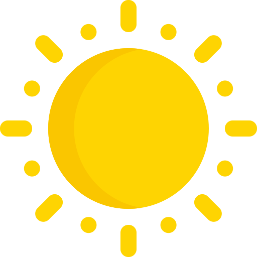
- Dla Ikony [cloud.png](./media/cloud.png) - [Freepik](https://www.flaticon.com/authors/freepik) 
- Dla Ikony [sun-behind-a-cloud.png](./media/sun-behind-a-cloud.png) - [Freepik](https://www.flaticon.com/authors/freepik) 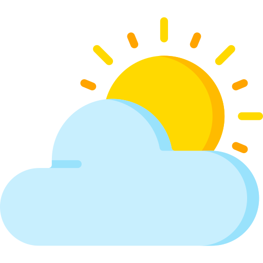
- Dla Ikony [wind.png](./media/wind.png) - [Freepik](https://www.flaticon.com/authors/freepik) 
- Dla Ikony [heavy-rain.png](./media/heavy-rain.png) - [Freepik](https://www.flaticon.com/authors/freepik) 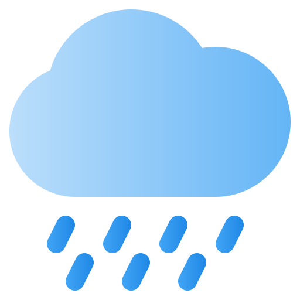
- Dla Ikony [drizzle.png](./media/drizzle.png) - [Christ Design](https://www.flaticon.com/authors/christ-design) 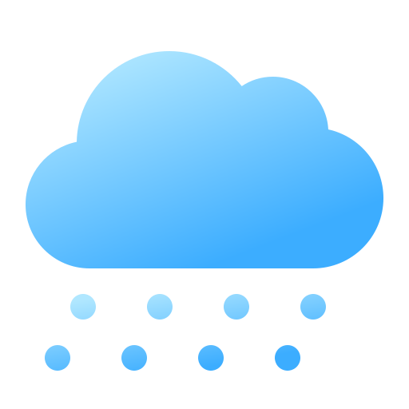
- Dla Ikony [snow.png](./media/snow.png) - [Freepik](https://www.flaticon.com/authors/freepik) 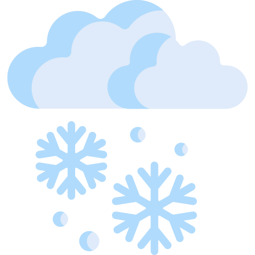
- Dla Ikony [fog.png](./media/fog.png) - [Freepik](https://www.flaticon.com/authors/freepik) 
- Dla Ikony [storm.png](./media/storm.png) - [Freepik](https://www.flaticon.com/authors/freepik) 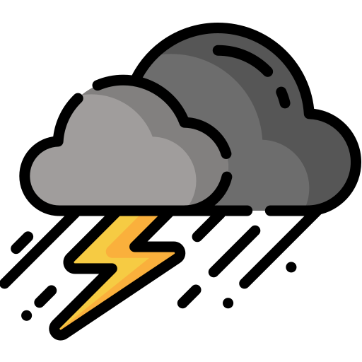
- Dla Ikony [hot.png](./media/hot.png) - [Freepik](https://www.flaticon.com/authors/freepik) 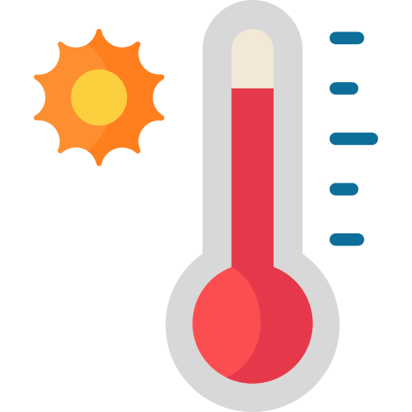
- Dla Ikony [cold.png](./media/cold.png) - [Freepik](https://www.flaticon.com/authors/freepik) 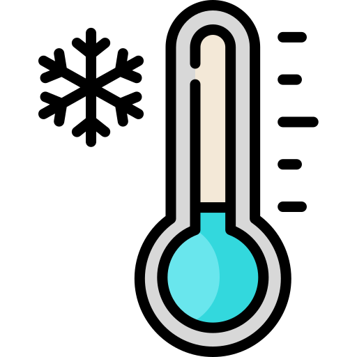
- Dla Ikony [freezing_drizzle.png](./media/freezing_drizzle.png) - [Shashank Singh](https://www.flaticon.com/authors/shashank-singh) 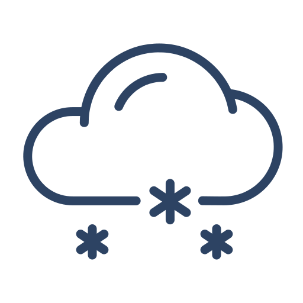
- Dla Ikony [light_rain.png](./media/light_rain.png) - [Nendra Wahyu](https://www.flaticon.com/authors/nendra-wahyu) 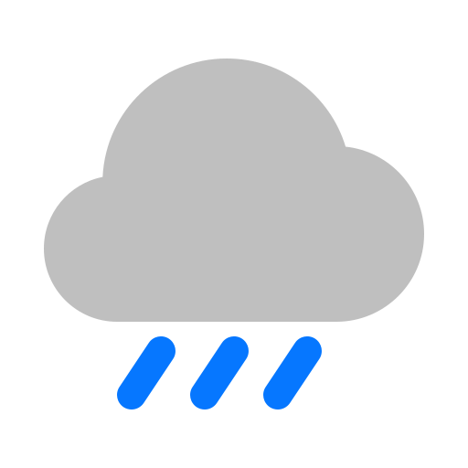
- Dla Ikony [freezing_rain.png](./media/freezing_rain.png) - [Icon home](https://www.flaticon.com/authors/icon-home) 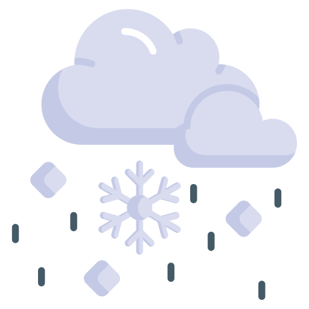
- Dla Ikony [hail.png](./media/hail.png) - [Freepik](https://www.flaticon.com/authors/freepik) 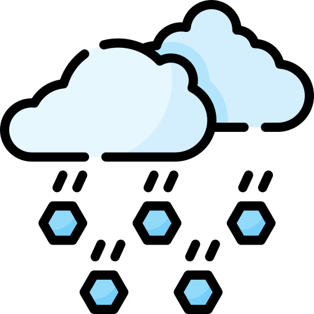
- Dla Ikony [thunderstorm.png](./media/thunderstorm.png) - [Freepik](https://www.flaticon.com/authors/freepik) 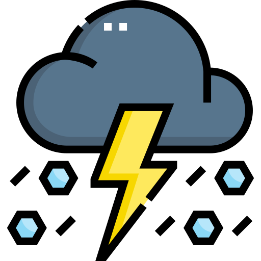
- Dla Ikony [humidity.png](./media/humidity.png) - [Freepik](https://www.flaticon.com/authors/freepik) 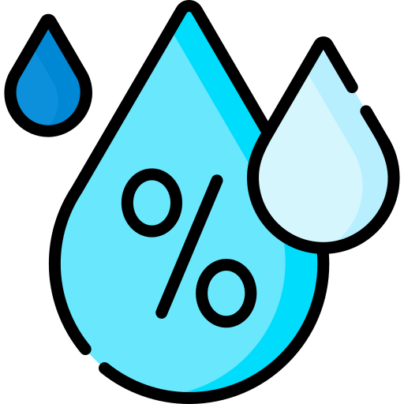
- Dla Ikony [error.png](./media/error.png) - [hqrloveq](https://flaticon.com/authors/hqrloveq) 
- Dla Ikony [warning.png](./media/warning.png) - [Good Ware](https://www.flaticon.com/authors/good-ware) 
- Dla Ikony [question.png](./media/question.png) - [Freepik](https://www.flaticon.com/authors/freepik) 
- Dla Ikony [pressure.png](./media/pressure.png) - [shmai](https://www.flaticon.com/authors/shmai) 
- Dla Ikony [leaf.png](./media/leaf.png) - [Freepik](https://www.flaticon.com/authors/freepik) 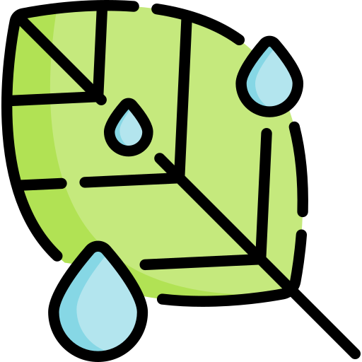
- Dla Ikony [length.png](./media/length.png) - [JunGSa](https://www.flaticon.com/authors/jungsa) 